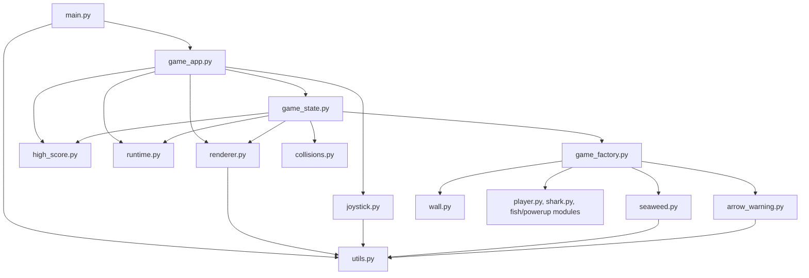

# FishFood Game

Welcome to FishFood, a thrilling arcade-style game where your objective is to survive, grow, and score high in an underwater world.

## Game Description

In FishFood, you are a small fish navigating the perils of a vast ocean. Your aim is to eat smaller fish to score points and grow, while strategically avoiding larger predators that threaten your survival.

### Key Features:

- **Dynamic Eating Mechanism**: Eat fish smaller than you to gain points and grow. Collide face-first into another fish to consume it.
- **Size-Based Menu**: A top-left menu indicates which fish you can eat based on your current size.
- **Predators and Power-ups**:
  - Beware of sharks! They can always eat you, except when miniaturized.
  - Seastars grant random power-ups: invincibility or shrinking sharks.
  - Seahorses increase your speed temporarily.
- **Variety of Fish**:
  - Small Red Fish: Worth 1 point, small and bounce off boundaries.
  - Small Green Fish: Worth 2 points, can grow into big green fish.
  - Big Green Fish: Worth 2 points. Predatory if larger than the player.
  - Silver Fish: Worth 3 points, periodically crosses the screen.
  - Rainbow Fish: Changes size and behavior. Predatory when larger than the player.
  - Big Bright Blue Fish: Appears every 50 points and is always predatory.
- **Hazards**: Avoid jellyfish and sea snakes that can slow you down or cause size loss.

### Gameplay Notes:

- Platform Compatibility: Playable on both PC and mobile devices.
- Play on Browser: Available at [https://bradwyatt.itch.io/fishfood](https://bradwyatt.itch.io/fishfood).
- Controls: Simple movement controls (up, left, right, down) on mobile; arrow keys on PC for enhanced gameplay.

## Demo

<p align="center">
  </img>
</p>

## How To Play


## Technical Details

- **Programming Language**: Python 3.11+
- **Game Framework**: [pygame-ce](https://pyga.me/) (pygame Community Edition) — the actively maintained fork of pygame
- **Browser Builds**: [pygbag](https://pygame-web.github.io/) — compiles the pygame game to WebAssembly for the itch.io browser build

## Architecture Overview

High-level module relationships after the 2026 refactoring pass:



### File Structure Guide

- `main.py`: The top-level entrypoint. It initializes pygame, loads assets, creates the app, and starts the game loop.
- `game_app.py`: The app-level coordinator. It runs the main loop, handles screen flow, updates the active game session, and tells the renderer what to draw.
- `game_state.py`: The core gameplay state. It tracks score, player/enemy state, collisions, powerups, and screen transitions during a run.
- `game_factory.py`: The setup/composition module. It creates the player, enemies, powerups, environment objects, and helper sprites for a fresh game session.
- `renderer.py`: The drawing layer. It renders the start screen, info screen, game over screen, play screen, and HUD/UI overlay.
- `joystick.py`: The mobile/touch input helper. It manages the on-screen directional control logic.
- `collisions.py`: Shared collision helper functions used by gameplay code.
- `high_score.py`: High score persistence and loading logic.
- `runtime.py`: Runtime/environment flags, including behavior differences for browser or itch.io-style builds.
- `utils.py`: Shared assets, constants, and loading helpers for images, sounds, fonts, and screen sizing.
- `seaweed.py`: Environment/decorative animation for seaweed in the play area.
- `arrow_warning.py`: UI warning indicators that point to incoming off-screen threats.
- `wall.py`: Legacy wall/boundary sprite support used by the current play-area setup.
- `base_enemy.py`: Abstract base class shared by all enemy types — defines common movement, boundary handling, and sprite lifecycle logic.
- `player.py`, `shark.py`, `red_fish.py`, `green_fish.py`, `silver_fish.py`, `snake.py`, `bright_blue_fish.py`, `rainbow_fish.py`, `seahorse.py`, `jellyfish.py`, `star_powerup.py`: The gameplay entity modules for the player, enemies, hazards, and powerups.


## Installation and Running the Game

### Playing Online on itch.io

FishFood is easily accessible online! Just follow these simple steps to start playing:

1. Visit the game's page on itch.io: [FishFood on itch.io](https://bradwyatt.itch.io/fishfood)
2. Wait for the page and the application to fully load. Then, follow the provided instructions to start playing the game.

### Running Locally on Your PC

If you instead want to run FishFood on your local machine, follow these steps:

#### Prerequisites
Ensure you have Python installed on your PC. FishFood has been tested with Python 3.11+ and should also work on Python 3.12. You can download Python from [python.org](https://www.python.org/downloads/).

#### Clone the Repository
Clone the FishFood repository from GitHub to your local machine:
```
git clone https://github.com/bradwyatt/Fish-Food.git
```

#### Install Dependencies
Navigate to the cloned repository directory, create a virtual environment, and install the required dependencies:
```
cd Fish-Food
python3 -m venv .venv
source .venv/bin/activate       # macOS / Linux
# .venv\Scripts\activate        # Windows
pip install -r requirements.txt
```
This installs `pygame-ce` for the game engine and `pygbag` for browser builds.

#### Run the Game
Finally, run the game using Python:
```
python main.py
```

Now you're all set to enjoy FishFood on your PC!


## Collaboration and Contributions

I warmly welcome contributions to FishFood and am open to collaboration. Whether you have suggestions for improvements, bug fixes, or new features, please feel free to open an issue or submit a pull request on GitHub.

Additionally, I'm eager to collaborate with other developers and enthusiasts. If you're interested in working together to expand features, optimize code, brainstorm new game ideas, or even embark on new projects, I'd be delighted to hear from you. 

For contributions to FishFood:
- Open an issue or submit a pull request on GitHub repository: [Fish-Food](https://github.com/bradwyatt/Fish-Food)

For collaboration and more detailed discussions:
- Contact me at **GitHub**: [bradwyatt](https://github.com/bradwyatt)

Your ideas, skills, and enthusiasm are all greatly appreciated, and I look forward to the potential of working together.

## 2026 Updates: Refactoring and Cleanup

In preparation for publishing FishFood on itch.io, the project received a focused round of cleanup and modernization work. Performance was improved, duplicated gameplay code was reduced, and the project structure was refactored so the main entrypoint is much thinner and easier to maintain.

This update pass was completed with help from OpenAI Codex, which was used to support refactoring, cleanup, and implementation work across the codebase as part of the release-preparation process.

---

Get ready to dive into the competitive world of FishFood!
