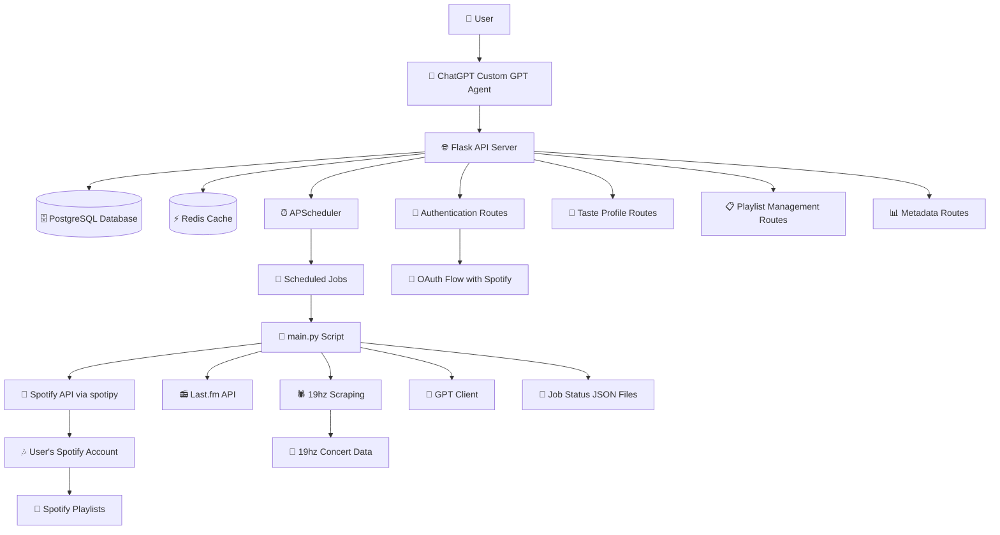
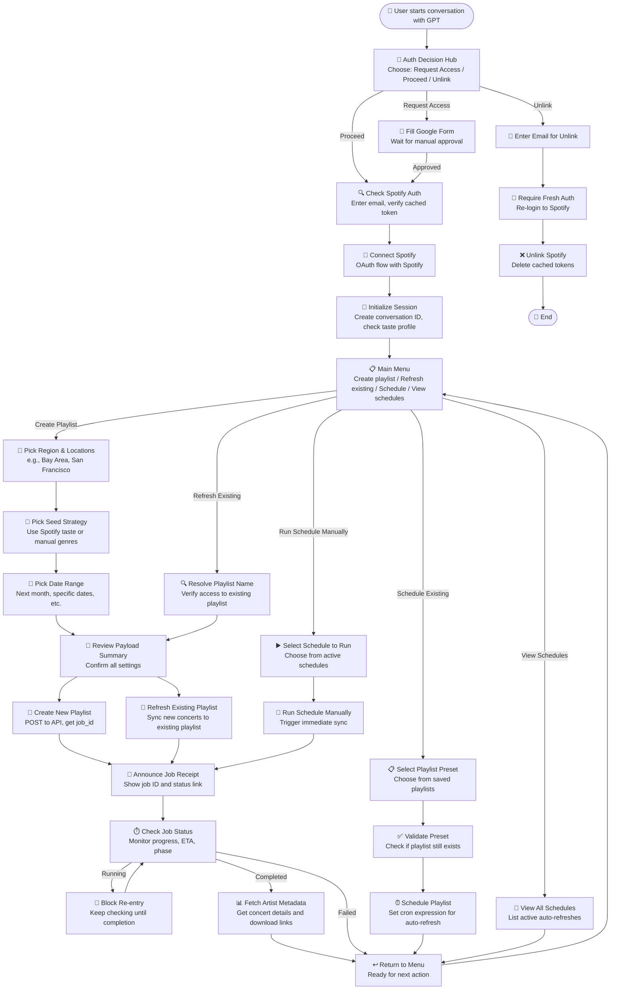

# Concert Curator (Alpha) - Green Room Edition 🎧
*Last updated: November 2, 2025*

## 📚 Overview

Concert Curator – Green Room Edition helps you discover live EDM shows and create playlists that match your music taste — from house and techno to pop and indie. "Green Room" hints at your connected streaming world.

It combines:
- Custom GPT step flows (via OpenAPI)
- A Flask backend server (`app.py`)
- Spotify API for auth + playlist management
- Redis for temporary token storage (WSL local for dev, Redis Cloud for production)
- Ngrok for public tunneling
- GPT as a conversational UI layer

## 🎯 Why Concert Curator?

Ever spent hours scrolling through event listings looking for concerts by artists you actually love? Concert Curator solves this by **automating the entire discovery-to-playlist workflow**:

- **Smart Discovery**: AI understands your taste from your Spotify listening history and finds live shows by artists you care about — not just what algorithms think you should hear
- **Never Miss a Show**: Automatically tracks upcoming concerts in your favorite regions and syncs them into a playlist, updated as new events are announced
- **Save Hours**: Instead of manually checking multiple event sites (Ticketmaster, Resident Advisor, 19hz, etc.) each week, Concert Curator does it for you
- **Curated Intelligence**: Combines your streaming taste, Spotify followers, artist metadata, and real-time concert data into one seamless experience
- **Easy to Use**: Just chat with GPT. No complex menus or spreadsheets — describe your preferences and let AI handle the rest
- **Scalable Automation**: Set up once, let it run. Auto-refresh your playlists daily, weekly, or monthly to stay current with newly announced shows
- **Discover Before You Go**: Scroll through the Spotify playlist and preview songs from each artist. Skip artists you don't vibe with, fall in love with new ones — and the playlist is ordered by concert date, so you're simultaneously learning when each show is happening
- **Export & Share**: Download concert metadata as CSV or JSON for analysis, sharing, or planning road trips

Whether you're a house fanatic in SF, a techno devotee in LA, or a pop fan hunting underground shows, Concert Curator connects your taste to real-world experiences.

## 🏷️ Editions

Concert Curator offers two editions, selectable via the homepage:

- **Green Room Edition** (current): Spotify integration, available now at `/spotify`.
- **Orange Wave Edition** (coming soon): SoundCloud integration, preview at `/soundcloud`.

---

## 🛠 Setup

### 1. Prerequisites
- Anaconda (Python 3.11)
- WSL + Redis installed (`sudo apt install redis-server`) for local development
- Redis Cloud account (redis.io free tier) for production deployment
- Ngrok account + tunnel subdomain
- A Spotify Developer App (Client ID/Secret)

### 2. Local Development Startup
Run this batch file to launch the app locally:
`C:\Users\Brad\Documents\GitHub\gpt-concert-curator\start_concert_curator_local.bat`

Includes:
- Starts Redis in WSL
- Activates Conda env
- Launches Flask (`app.py`)
- Opens Ngrok tunnel
- Opens Spyder (optional)

### 3. Staging Deployment
For EC2 Staging deployment, use `start_concert_curator_staging.bat` which:
- Connects to appropriate staging databases
- Sets `RUN_MODE=staging` for staging environment detection
- Starts the Flask app with Waitress on port 5001
- Uses staging Ngrok tunnel (`toney-unbreezy-hypochondriacally.ngrok-free.dev`)

### 4. Production Deployment
For EC2 Production deployment, use `start_concert_curator_prod.bat` which:
- Connects to Redis Cloud (redis.io free tier) using environment variables:
  - `REDIS_HOST`: Your Redis Cloud host
  - `REDIS_PORT`: Your Redis Cloud port
  - `REDIS_PASSWORD`: Your Redis Cloud password
- Sets `RUN_MODE=prod` for environment detection
- Starts the Flask app with Waitress on port 5000

**Redis Cloud Setup:**
1. Create a free account at [redis.io](https://redis.io/)
2. Create a free database (30MB limit, no credit card required)
3. Note the host, port, and password from the database details
4. Update `start_concert_curator_ec2.bat` with these credentials (password is redacted in the file)

## 🔗 Architecture

### System Architecture



### User Journey (Workflow Behavior Spec)



🔒 Authentication
- Uses standard Spotify OAuth for authorization.
- Auth cache is stored temporarily in Redis.
- Endpoints verify if the user is authenticated and matches the provided email.

| Endpoint                     | Method | Auth Required | Purpose                   |
| ---------------------------- | ------ | ------------- | ------------------------- |
| `/api/check-auth`    | POST   | ✅             | Verify platform auth       |
| `/api/create-playlist` | POST | ✅             | Create new playlist       |
| `/api/sync-concerts-to-playlist` | POST | ✅             | Sync concerts to playlist |
| `/api/status/{job_id}`       | GET    | ❌             | Get job status            |
| `/api/metadata-preview/{job_id}` | GET | ❌             | Preview artist metadata   |
| `/api/metadata-csv/{job_id}` | GET    | ❌             | Download metadata as CSV  |
| `/api/metadata-full/{job_id}` | GET   | ❌             | Download full metadata    |

🧠 GPT Flow Highlights
- Standard OAuth for authentication
- Auto-generates playlist names based on genre
- User-friendly genre input (pipe- or comma-separated)
- Supports user intent for playlist creation vs. refresh
- Provides metadata exports for completed jobs

## 📊 Metadata Exports

After syncing concerts to a playlist, access detailed metadata about the artists added:

- **Preview**: Get a JSON preview of artist info (name, genre, date, venue, Spotify followers).
- **Full JSON**: Download complete metadata as JSON.
- **CSV Download**: Export metadata as a CSV file for analysis or sharing.

Use the `/api/metadata-*` endpoints with the job ID from a sync operation.

## 📊 Database Schema

The database schema consists of 7 tables tracking users, playlist operations, API analytics, taste profiles, and automated scheduling. See [DATABASE_SETUP.md](DATABASE_SETUP.md) for the complete ER diagram and data dictionary.

🗓️ Scheduling (Auto-Refresh)

Automatically keep your concert playlists up-to-date with scheduled syncs.

### How It Works
1. After creating/syncing a playlist, a **preset** is saved with your configuration
2. Create a **schedule** (daily or weekly) linked to that preset
3. The playlist automatically refreshes with new concerts based on your schedule

### Quick Start via API

**Note:** The examples below use the staging environment URL (`https://toney-unbreezy-hypochondriacally.ngrok-free.dev/`). Replace this with your production URL (`https://concertcurator.ngrok.io`) or dev/staging URL as appropriate.

**Create a schedule:**
```bash
curl -X POST https://toney-unbreezy-hypochondriacally.ngrok-free.dev/api/schedules \
  -H "X-Auth-Token: YOUR_TOKEN" \
  -H "Content-Type: application/json" \
  -d '{
    "user_email": "user@example.com",
    "playlist_id": "37i9dQZF1DXcBWIGoYBM5M",
    "schedule_type": "daily",
    "conversation_id": "550e8400-e29b-41d4-a716-446655440000",
    "schedule_description": "Daily at 9:00 AM PST"
  }'
```

**List your schedules:**
```bash
curl https://toney-unbreezy-hypochondriacally.ngrok-free.dev/api/schedules/user@example.com \
  -H "X-Auth-Token: YOUR_TOKEN"
```

**Manually run a schedule:**
```bash
curl -X POST https://toney-unbreezy-hypochondriacally.ngrok-free.dev/api/schedules/1/run \
  -H "X-Auth-Token: YOUR_TOKEN" \
  -H "Content-Type: application/json" \
  -d '{
    "user_email": "user@example.com",
    "conversation_id": "550e8400-e29b-41d4-a716-446655440000"
  }'
```

**Update a schedule:**
```bash
curl -X PUT https://toney-unbreezy-hypochondriacally.ngrok-free.dev/api/schedules/1 \
  -H "X-Auth-Token: YOUR_TOKEN" \
  -H "Content-Type: application/json" \
  -d '{
    "user_email": "user@example.com",
    "playlist_id": "37i9dQZF1DXcBWIGoYBM5M",
    "schedule_type": "weekly",
    "conversation_id": "550e8400-e29b-41d4-a716-446655440000",
    "cron_expression": "0 9 * * 1",
    "schedule_description": "Weekly on Mondays at 9:00 AM"
  }'
```

**Delete a schedule:**
```bash
curl -X DELETE https://toney-unbreezy-hypochondriacally.ngrok-free.dev/api/schedules/1 \
-H "X-Auth-Token: YOUR_TOKEN" \
-H "Content-Type: application/json" \
  -d '{"user_email": "user@example.com"}'
```

### Prerequisites
- A synced playlist (creates a preset automatically)
- Valid Spotify authentication
- Sufficient scheduling quota (default: 3 schedules per user)

### Notes
- Presets store your sync configuration (genres, region, date range, etc.)
- Schedules require an existing preset; if the preset is deleted, manual runs will fail
- Manual runs require a valid Spotify cache token
- See DATABASE_SETUP.md for schema details

🚀 Future Ideas
- Genre-based concert filters
- UI layer for non-GPT users

🐛 Troubleshooting
- Redis not working locally? Run: `wsl redis-server --daemonize yes`
- Redis not working on EC2? Check your Redis Cloud credentials in `start_concert_curator_ec2.bat`
- Failed to talk to connector? Check for 200 status codes in Flask
- Token invalid? It may be expired or mismatched purpose
- You need to be approved by Brad Wyatt on the Spotify app site
- To prevent "Error Talking to Connector" in Custom GPT, we label "200" HTTP Status codes for most of the API calls.
- If the link the Custom GPT sends you doesn't work, it might be because you didn't wait until ChatGPT finished its response. Wait until it finishes its response before clicking the link.
- **Time Zone Note**: Date and time references in the app use Pacific Time (PT) since the developers and testers are located in California. If this causes issues (e.g., for users in other time zones), please contact Brad Wyatt for adjustments.

## 🚀 Deployment and Release Process

Follow these steps to release updates when Flask server, workflow behavior spec, global instructions, or GPT actions are updated:

1. **Update files on local machine** as usual (commit to `main` branch).
2. **Run `deploy/update_openapi_env.bat`** on local PC to regenerate OpenAPI specs.
3. **Update DEV GPT app** (chatgpt.com): Copy/paste `deploy/dev/global_instructions_dev_latest.txt` to Global Instructions (if updated). Replace Workflow Behavior Spec with `deploy/dev/workflow_behavior_spec_dev_latest.txt` (if updated). In GPT Actions, paste `deploy/dev/openapi_gpt_dev_latest.yaml` to Schema (re-enter AUTH_TOKEN if needed).
4. **Start local Flask server** via `start_concert_curator_local.bat`.
5. **Test locally**: Run tests, use Postman with DEV environment for endpoints.
6. **Update STAGING GPT app** (chatgpt.com): Copy/paste `deploy/staging/global_instructions_staging_latest.txt` to Global Instructions (if updated). Replace Workflow Behavior Spec with `deploy/staging/workflow_behavior_spec_staging_latest.txt` (if updated). In GPT Actions, paste `deploy/staging/openapi_gpt_staging_latest.yaml` to Schema (re-enter AUTH_TOKEN if needed).
7. **Remote into EC2 Staging** (AWS EC2, US-West-1 — Staging instance).
8. **Run deployment on STAGING EC2** to pull latest code and restart services.
9. **Smoke test STAGING**: Test via ChatGPT or Postman endpoints.
10. **Update PROD GPT app** (chatgpt.com): Copy/paste `deploy/prod/global_instructions_prod_latest.txt` to Global Instructions (if updated). Replace Workflow Behavior Spec with `deploy/prod/workflow_behavior_spec_prod_latest.txt` (if updated). In GPT Actions, paste `deploy/prod/openapi_gpt_prod_latest.yaml` to Schema (re-enter AUTH_TOKEN if needed).
11. **Remote into EC2 Prod** (AWS EC2, US-West-1 — Prod instance).
12. **Run `deploy_prod.bat`** on Prod EC2. On success, close ngrok and Flask windows.
13. **Restart PROD services** via `start_concert_curator_prod.bat`.
14. **Smoke test PROD**: Test via ChatGPT or Postman endpoints.

## 📊 Monitoring

The monitoring status of the server can be viewed at https://stats.uptimerobot.com/1NSZ5mEjOZ.

## 🐛 Known Bugs
- GPT does not delete schedules due to treating the delete operation like a POST request.

📁 File Structure

app.py               ← Main Flask app setup, logging, static routes, and edition routing
routes/              ← Modular API route handlers (auth, playlist, etc.)
templates/           ← HTML templates for web pages (home.html, privacy_policy.html)
schemas.py           ← Marshmallow schemas for API validation
utils.py             ← Shared helper functions and constants
gpt_step_flow.txt    ← GPT step config
static/openapi_smorest.yaml ← Auto-generated OpenAPI spec (full, from flask-smorest)
static/openapi_gpt.yaml  ← Manually curated OpenAPI spec (lean, for GPT)
global_instructions.txt ← Global instructions for GPT behavior (base)
start_concert_curator_local.bat ← Local DEV startup script
start_concert_curator_staging.bat ← EC2 Staging startup script
start_concert_curator_prod.bat ← EC2 Production startup script
deploy/ ← Environment-specific configuration files
├── dev/ ← Local DEV environment
├── staging/ ← EC2 Staging environment
└── prod/ ← EC2 Production environment

## OpenAPI Specifications

The project uses two OpenAPI YAML files for different purposes:

- **openapi_smorest.yaml**: Auto-generated from the Flask-Smorest code in `app.py` and `routes/`. This is the comprehensive spec used for development Swagger UI (`/apidocs-smorest`). It includes all endpoints, schemas, and details. Access the live version at `/static/openapi_smorest.yaml` in the running app.
- **openapi_gpt.yaml**: A manually curated, lean version tailored for GPT integration. It has simplified schemas, inline examples, and focuses on key operations for conversational AI. Used for the GPT Swagger UI (`/apidocs-gpt`).

Differences: Smorest is full and auto-updating with code changes; GPT is static, streamlined, and includes ngrok servers for external access.

🧠 Continuing This Project in ChatGPT
To resume this project in a new ChatGPT thread, start your message with this context block:

```
I'm working on a Flask-based backend for a Custom GPT that builds and syncs Spotify playlists based on upcoming concerts. The app uses:
- A modular Flask server (`app.py` and `routes/`)
- Redis (via WSL) for short-lived "freshness tokens"
- Ngrok for public access (production: `https://concertcurator.ngrok.io` on Windows EC2; dev: `https://toney-unbreezy-hypochondriacally.ngrok-free.dev/` on local Windows)
- Spotify OAuth and playlist management
- A GPT-driven step flow defined in `gpt_step_flow.txt`
- OpenAPI schemas: `static/openapi_smorest.yaml` (auto-generated, full) and `static/openapi_gpt.yaml` (manually curated, lean for GPT)

Freshness tokens are stored in Redis with RUN_MODE prefixes to prevent overlap between environments:
- **Local**: `local:fresh:{purpose}:{user_email}`
- **Staging**: `staging:fresh:{purpose}:{user_email}`
- **Prod**: `prod:fresh:{purpose}:{user_email}`

These tokens are required for endpoints like `/delete-auth-cache` and `/create-playlist`.

Swagger UIs: `/apidocs-smorest` (dev, from openapi_smorest.yaml) and `/apidocs-gpt` (GPT, from openapi_gpt.yaml). Enabled only if `debug_mode = True` in `config.py`. Batch startup is handled via `start_concert_curator.bat`.

Let's continue from here.
```

📎 Tip: You can also upload the following files for continuity:
- static/openapi_smorest.yaml
- static/openapi_gpt.yaml
- global_instructions_prod.txt or global_instructions_dev.txt (choose based on prod/dev)
- workflow_behavior_spec.txt (uses ${BASE_URL} from global_instructions)
- app.py
- routes/ (all files)
- schemas.py
- utils.py
- config.py
- start_concert_curator.bat

👤 Author

Built by Brad Wyatt for fun and learning.
