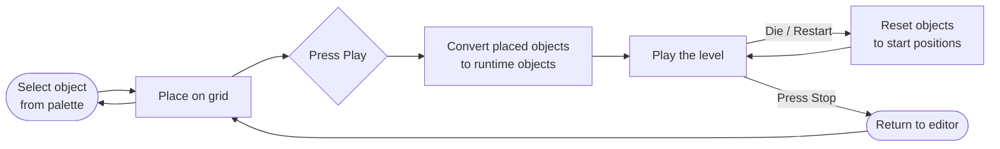
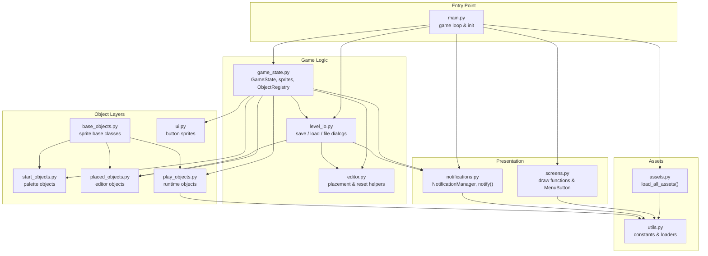
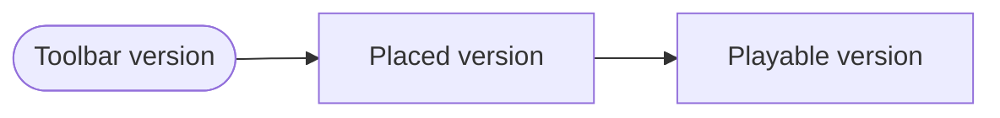

# Propeller Platformer Level Editor

An arcade-style platformer and in-engine level editor built with Python and Pygame.

Design a level, press play, and immediately test the exact layout you just built.

The core loop is simple:

1. Build a level in edit mode.
2. Drop in a player spawn, a goal door, terrain, hazards, and enemies.
3. Switch to play mode instantly to test the level.
4. Collect every diamond, then reach the door to win.

This project is more than a map painter. It contains a full playable platformer with enemy behaviors, hazards, restart logic, mobile-friendly touch controls, and a deliberate architecture split between editor data and runtime gameplay objects.

## Demo

<p align="center">
  
</p>

## What The Game Includes

- Edit mode with drag-and-place level construction
- Instant switch between editor and play testing
- Grid-snapped placement inside a bounded build area
- Eraser mode for deleting placed objects
- Rotatable standing spikes
- Restart flow and death counter during play mode
- Mobile accessibility controls for movement and jump
- Bundled sample levels in [`levels/`](./levels)

## Objective

To beat a level, the player must:

1. Collect all diamonds.
2. Reach the door after every diamond has been collected.

If the player hits an enemy or hazard, falls out of bounds, or otherwise dies, the play session restarts from the placed spawn point.

This gives the project a nice designer workflow: build a challenge, hit play, fail quickly, adjust the layout, and try again.

## Game Objects

The editor supports the following level pieces:

- `Player`: the spawn point for the playable character
- `Door`: the exit, which opens only after all diamonds are collected
- `Wall`: solid terrain
- `Reverse Wall`: invisible trigger wall used to reverse enemy direction
- `Diamond`: collectible required for victory
- `Flyer`: horizontal moving enemy
- `Smily Robot`: ground-based enemy with gravity and directional movement
- `Spring`: bounces the player upward
- `Sticky Block`: solid block that changes jump behavior by preventing a normal grounded jump reset pattern
- `Fall Spikes`: spikes that begin falling when the player moves underneath
- `Stand Spikes`: stationary spikes with rotation support

## Controls

### Edit Mode

- Click a palette object across the top to select it
- Click on the grid to place one object
- Click and drag across the grid to paint repeated objects
- Click the same palette item again to deselect it
- Use the eraser button to remove placed objects
- Use the rotate button to rotate standing spikes before placement
- Use the clear button to wipe the current layout
- Use the info button to open the instructions screen
- Use the play button to convert the current edit layout into a playable level

### Play Mode

- Move left and right with the on-screen arrows
- Jump with the jump button
- The player has a double-jump style propeller move
- Press restart to reset the current attempt
- Press the stop button to return to edit mode

### Pause

- Press `Space` to toggle pause

## Installation

### Requirements

- Python 3
- Pygame

The repository currently pins:

```txt
pygame==2.6.1
```

Using a virtual environment is recommended:

```bash
python3 -m venv .venv
source .venv/bin/activate
pip install -r requirements.txt
```

If you prefer not to use a virtual environment, you can still run:

```bash
pip install -r requirements.txt
```

## Running The Project

From the repository root:

```bash
source .venv/bin/activate
python main.py
```

Desktop mode enables the in-editor save and load buttons and uses native file dialogs to choose `.lvl` filenames.

## Built With

- Python
- Pygame
- Sprite-based object architecture
- Grid-based level authoring
- Touch-friendly runtime controls

## Bundled Levels

The repo includes several example level files:

- [`Levels/level1.lvl`](./Levels/level1.lvl)
- [`Levels/level2.lvl`](./Levels/level2.lvl)
- [`Levels/level3.lvl`](./Levels/level3.lvl)
- [`Levels/testing.lvl`](./Levels/testing.lvl)

These files store object positions in a Python-literal dictionary format, with keys such as `player`, `door`, `wall`, `flyer`, `diamonds`, and others.

Save and load are enabled on desktop runs of the app. The save button writes a `.lvl` file to the `Levels/` directory; the load button restores it into the editor canvas. On web (itch.io) builds, save and load are disabled.

## Architecture

This codebase is organized around a very practical split: editor-time objects, play-time objects, and shared base classes.

At a portfolio level, that is the key technical idea in this project. The editor is not just drawing tiles onto the screen. It creates one representation of the world for authoring, then transforms that data into a separate playable simulation.

### Architecture At A Glance



Build a level, press play, beat it or go back and change it.

### Module Map



If you are new to the codebase, start with [`main.py`](./main.py). It is the entry point and game loop. [`game_state.py`](./game_state.py) is where `GameState` and all the sprite helper classes live.

### High-Level Flow

[`main.py`](./main.py) is a thin orchestrator. It owns:

- Pygame initialisation, screen, and clock
- Loading assets via [`assets.py`](./assets.py)
- Creating `GameState`
- Driving the main loop across app screens (main menu, level select, game, instructions)

The most important concept is that the game does not directly play the editor sprites. Instead, it builds a separate runtime version of the level when you press play.

That keeps the editor responsive and simple while letting gameplay objects own their own movement, collision, and restart behavior.

### State Model

[`game_state.py`](./game_state.py) defines `GameState`, which acts as the central coordinator for:

- Sprite groups
- Selected editor object
- Drag state
- Eraser state
- Mouse and touch input flags
- Play/edit mode switching
- References to singleton-style objects like the placed player and placed door

This keeps most session-wide logic in one place instead of scattering it across sprites.

For a project of this size, that tradeoff works well. It avoids overengineering while still giving the program one clear source of truth for interaction state.

### Shared Base Classes

[`base_objects.py`](./base_objects.py) provides the inheritance backbone:

- `StartGameObject`: top palette objects shown in the editor UI
- `PlacedObject`: editor-placed level pieces
- `PlayObject`: runtime versions of level pieces used during actual gameplay

This separation is important because the editor and the game need different behavior even when they represent the same thing visually.

### Editor Layer

The editor is primarily built from two concepts:

- Start objects in [`start_objects.py`](./start_objects.py)
- Placed objects in [`placed_objects.py`](./placed_objects.py)

`start_objects.py` contains the top-bar palette versions of objects. These are the pieces the user clicks to select or drag from.

`placed_objects.py` contains the objects that exist in the editable level canvas. These sprites are mostly lightweight containers for position, image, and type.

The editor behavior in [`game_state.py`](./game_state.py) and [`editor.py`](./editor.py) handles:

- Snap-to-grid placement
- Drag painting across multiple cells
- Object deletion
- Rotation state for spikes
- Single-instance rules for the player and door

In practice, this makes the editor feel closer to a level-painting tool than a one-object-at-a-time placer.

### Runtime Layer

When the user enters play mode, `switch_to_play_mode()` in [`game_state.py`](./game_state.py) converts the placed editor objects into runtime objects from [`play_objects.py`](./play_objects.py).

This is one of the strongest design choices in the project:

- Edit-time data stays simple
- Play-time sprites carry movement, collision, restart, scoring, and animation logic
- Returning to edit mode can cleanly destroy the runtime layer without damaging the editor layout

That conversion step is the architectural center of the project.



The same idea shows up across the codebase: one object type can have an editor version and a separate gameplay version.

### Object Registry

All per-type object lists (walls, flyers, diamonds, etc.) live in a single `ObjectRegistry` dataclass defined in [`game_state.py`](./game_state.py) and passed into objects at construction time:

```python
@dataclass
class ObjectRegistry:
    placed_walls: list = field(default_factory=list)
    play_walls: list = field(default_factory=list)
    placed_flyers: list = field(default_factory=list)
    play_flyers: list = field(default_factory=list)
    # ...
```

This pattern is used heavily for:

- Collision checks
- Restarting objects
- Destroying all objects of a given type
- Converting editor objects into runtime objects
- Exporting object positions into level dictionaries

It is a simple but effective alternative to a more formal ECS or scene graph, and avoids the shared mutable class-level state that the original design relied on.

### Player And Gameplay Logic

[`play_objects.py`](./play_objects.py) contains most of the game rules:

- `PlayPlayer` handles gravity, movement, jumping, propeller-assisted second jump, collision, facing direction, score, and death count
- `PlayDoor` opens only when the player has collected all diamonds
- `PlayFlyer` patrols horizontally and reverses on collisions
- `PlaySmilyRobot` uses gravity plus horizontal roaming and can be stomped from above
- `PlayFallSpikes` activate when the player moves underneath them
- `PlaySpring` launches the player upward

Gameplay resolution during play mode is coordinated by `play_mode_function()` in [`game_state.py`](./game_state.py), which checks:

- Player movement inputs
- Hazards and enemy collisions
- Diamond collection
- Door win condition
- Restart triggers

Together, these systems make the project feel like a real game rather than just an editor prototype.


### UI Layer

[`ui.py`](./ui.py) contains button sprites for editor and play interactions, including:

- Clear
- Info
- Eraser
- Restart
- Grid
- Save / load buttons

[`game_state.py`](./game_state.py) adds the higher-level interactive behavior on top of these sprites.

### Asset Loading

[`assets.py`](./assets.py) contains `load_all_assets()`, which registers every image, sound, and transparent surface into the `images` and `sounds` dicts before the game loop starts.

[`utils.py`](./utils.py) provides the shared constants and low-level helpers it relies on:

- Screen dimensions
- FPS
- `load_image()`
- `load_sound()`
- `load_font()`

### Restart And Reset Pipeline

The reset flow is split into three clear functions in [`editor.py`](./editor.py):

- `remove_all_placed()` clears the editor canvas
- `remove_all_play()` destroys runtime play-mode objects
- `restart_level()` resets runtime objects back to their original placed positions

That distinction makes it possible to:

- wipe a level from the editor,
- restart a play session without losing the layout,
- and switch cleanly back from play mode to edit mode.

## Project Structure

```text
LevelEditor/
│
│  Entry point
├── main.py               # Application entry point and async game loop.
│                         # Initialises Pygame, loads assets, creates GameState,
│                         # and drives the main loop across all app screens
│                         # (main menu, level select, game, instructions).
│
│  Game logic
├── game_state.py         # Central coordinator. Holds GameState (sprite groups,
│                         # input flags, edit/play mode switching), ObjectRegistry
│                         # (all per-type object lists), AppScreen enum, and all
│                         # editor/play helper sprite classes (Grid, Start, etc.).
├── editor.py             # Stateless helpers for level editing: snap_to_grid,
│                         # remove_placed_object, remove_all_placed, remove_all_play,
│                         # restart_level, restart_start_objects.
├── level_io.py           # Save and load logic. Serialises placed objects to a
│                         # Python-literal .lvl file and restores them on load.
│                         # Also owns ITCH_MODE detection and file dialog helpers.
│
│  Presentation
├── screens.py            # All draw functions: draw_main_menu, draw_level_select,
│                         # draw_instructions_screen, draw_grid, draw_building_facades,
│                         # draw_yellow_outline. Also contains the MenuButton class.
├── notifications.py      # Timed on-screen message system. NotificationManager queues
│                         # and renders messages; notify() is a convenience wrapper
│                         # used by any module that needs to surface feedback to the user.
│
│  Assets
├── assets.py             # load_all_assets() — registers every image, sound, and
│                         # transparent surface into the images/sounds dicts before
│                         # the game loop starts.
├── utils.py              # Shared constants (screen size, FPS, grid spacing) and
│                         # low-level asset helpers: load_image, load_sound, load_font.
│
│  Object layers
├── base_objects.py       # Abstract sprite base classes: StartGameObject, PlacedObject,
│                         # PlayObject. Define the common interface inherited by all
│                         # three object families.
├── start_objects.py      # Palette objects shown in the editor toolbar. One class per
│                         # game object type (e.g. StartWall, StartFlyer). Clicked by
│                         # the user to select what they want to place.
├── placed_objects.py     # Editor-canvas objects. Lightweight sprites that record
│                         # position and image for each placed game piece. Converted
│                         # to play objects when the user presses Play.
├── play_objects.py       # Runtime gameplay objects with full behaviour: gravity,
│                         # movement, collision, animation, restart logic. One class
│                         # per game object type (e.g. PlayPlayer, PlayFlyer).
├── ui.py                 # Button sprites for editor and play-mode UI: Clear, Eraser,
│                         # Grid, Info, Save, Load, Restart, and the play/edit toggle.
│
│  Data directories
├── Levels/               # Bundled .lvl sample levels stored as Python-literal dicts.
├── Sprites/              # All game and UI artwork (PNG files).
├── Sounds/               # Music and sound effect files.
└── Docs/                 # Demo GIF, screenshots, and instruction screen images.
```

## Notes And Limitations

- The project is designed around a fixed screen size of `1024x600`
- The build area is constrained by UI boundaries and grid offsets defined in `GameState`
- Save and load are disabled on web (itch.io) builds; desktop runs have full file dialog support
- Runtime behavior is coordinated through `ObjectRegistry` rather than a data-driven entity system

## Why This Project Is Interesting

This project is a strong example of a small game toolchain living inside the game itself.

It combines level editing, runtime conversion, platforming mechanics, enemy logic, and playtesting inside a single Pygame application:

- The editor and the game live in the same application
- Levels can be built, tested, and saved as playable level files
- The code separates authoring-time sprites from gameplay-time sprites across dedicated modules
- It is small enough to understand, but rich enough to show real game architecture decisions
- It demonstrates how tooling and gameplay can coexist without introducing a heavy engine architecture

For anyone studying game programming, it is especially useful as a readable example of how to separate editor-time data from runtime simulation.

It also shows a good instinct for project scope: the game is ambitious enough to be interesting, but constrained enough to stay understandable.

## 2026: AI-Assisted Refactor

In March 2026, the codebase went through a significant cleanup session with Claude (Anthropic's AI) used as a pair programming assistant.

The main changes:

- `main.py` was a God Object — it was split into focused modules (`game_state.py`, `editor.py`, `level_io.py`, `notifications.py`)
- Global mutable class-level lists were replaced with an `ObjectRegistry` dataclass passed through the object graph
- Font loading was moved to startup to eliminate per-frame `pygame.font.SysFont` calls
- A visual test suite and unit tests were added to verify behavior before and after the refactor

The architecture described in this README reflects the state of the project after that refactor.

